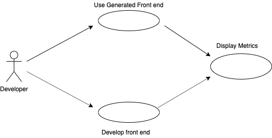
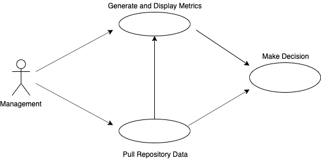

# Individual Requirements Analysis
Trey Shaw

# Introduction

This program is intended to give technology companies and IT organizations the ability to better assess the overall health of open source projects. By providing various metrics of the development of these projects, companies will be able to make better predictions about their sustainability. With this tool, organizations will be better equipped to make decisions on which open source projects to invest resources into.

# Software Product Overview

This program should implement a full stack solution that gives users the ability to pull data from repositories, repository groups, and other similar data.

### Metrics
Aside from the frontend out of the box, metrics can also be pulled from the database through a RESTful API. This includes information such as:
- new contributors over time
- top committers
- open issues
- issue response time
- fork count
- many other related metrics

# System Use

## Actor Surveys

### Organization Teams
These are users that will be assessing the health of open source projects with the metrics provided. These actors will install the system and pull data from repositories to generate the information they need to make decisions.

System Features:
- Collect and organize repository information
- Display metrics

### Frontend Developers
These are users that will be developing their own frontend systems to display and interpret data given by the system's RESTful API.

System Features:
- Expose repository/repository group metric information

# System Requirements

- Database engine
- GitHub Access Tokens
- API framework
- Frontend framework

### Functional Requirements
- Ability to install on a server or local machine
- Generation of metric data in database engine by gaining access to repositories
- Ability to generate standard frontend to display data
- Expose metrics through endpoints when running

# Design Constraints
Web application should be able to run on all major browsers, as well as mobile versions. Users will be able to select metric type and view type (line graph vs. pie chart, etc.). Backend should be able to run on all major operating systems.
Users should be able to generate information from any repository they have read access to. Users should be able to retrieve metrics from API calls.

# Purchased Components
- Atmosphere instance

# Interfaces
Command line interface for running service, and webpage interface for viewing metrics in frontend.
