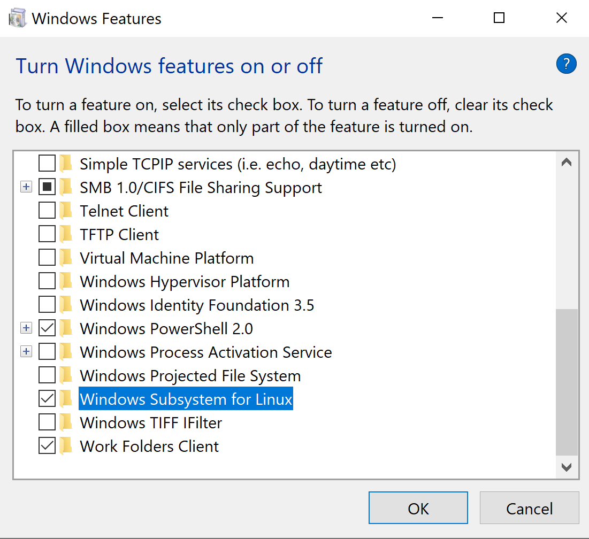

# Augur Windows Installation

https://github.com/chaoss/augur/issues/403

## Enable Linux Subsystem

First, you will need to enable bash in Windows. Navigate to control panel and find "Turn Windows features on or off". Now enable Windows Subsystem for Linux. (You may need to restart your machine after doing this).



Before you can use the subsystem in the command line, you'll need to install a Linux distro in the Microsoft store as well. I'll be using [Ubuntu](https://www.microsoft.com/en-us/p/ubuntu/9nblggh4msv6?activetab=pivot:overviewtab) for this example.


Now that you have the subsystem enabled, and a distro to use, you can launch the subsystem using the ```wsl``` command.

Your Windows file system is still here too so you can access all of your other files. Your C:/ directory can be found at /mnt/c/.

## Dependencies

### Python

You'll need to get Python and VirtualEnv on the subsystem. Make sure you're in wsl and run the following:
```
sudo apt-get install python3.7
sudo update-alternatives –install /usr/bin/python3 python3 /usr/bin/python3.7 2
sudo update-alternatives –config python3

pip3 install virtualenv
```

Now navigate to a directory you'll remember and create a virtual environment for Augur.
```
virtualenv –python=python3 newaugur
```

This will create a directory, newaugur (or whatever you named it). From the directory you ran the last command, use
```
source newaugur/bin/activate
```
to start the virtual environment. Use ```deactivate``` to exit the environment.

### Nodejs and NPM

Install NPM on Ubuntu (so we're still under wsl) with:
```
sudo apt-get install nodejs
```

Check the version of your Node install and make sure that it's the latest release. You may have trouble installing the latest version of NodeJs. [NVM](https://github.com/nvm-sh/nvm) is great way to easily get it. If you didn't have any trouble getting the latest version, go ahead and skip this step.
```
curl -o- https://raw.githubusercontent.com/nvm-sh/nvm/v0.35.0/install.sh | bash

nvm install --lts
```

## PostgreSQL Setup

You will need PostgreSQL on the linux subsystem for this to work. You can install [PostgreSQL](https://www.postgresql.org/download/windows/) for Windows if you want to use pgAdmin, but make sure to know the server information for the Linux installation when you run Augur.

Now go into the subsystem using ```wsl``` and run the following:
```
sudo apt install postgresql postgresql-contrib
```

After it installs, you must start it manually:

```
sudo /etc/init.d/postgresql start
```

You will need to create the database (and the user) you intend to load Augur's schemas into BEFORE installing Augur. It has trouble creating the database on its own.

To do this, you can access the postgress account, and then get to the postgres prompt with these commands:
```
sudo -i -u postgres

psql
```
From here, you can run the commands to create the user and database (not sure if I need to put these commands or not in this document). If you're having trouble with the postgres setup, [this](https://www.digitalocean.com/community/tutorials/how-to-install-and-use-postgresql-on-ubuntu-18-04) is a really nice walkthrough.

When you go to Augur install, you'll need to create the database and user first, and select option 2.

## Getting Augur

Using GitBash for Windows, or just through the wsl terminal, clone Augur from its [repository](https://github.com/chaoss/augur).
It is more risk free to do this on the subsystem.

## Installation

Congratulations, you now have everything you need to install and run Augur. Let's hope this works!
First, from the Windows command line, type ```wsl``` to start the subsystem. Now launch the virtual environment.
```
source newaugur/bin/activate
```

Navigate to where you cloned the Augur repository. From the Augur directory, you can run ```make install``` to start the Augur installation.

Augur should now install just like on a Unix system.

NOTE: You may get errors on the install if you cloned Augur using Windows. You may have to make sure that the scripts in augur/util/scripts/install all are using Unix line endings. If they aren't you can easily change them in a text editor.
